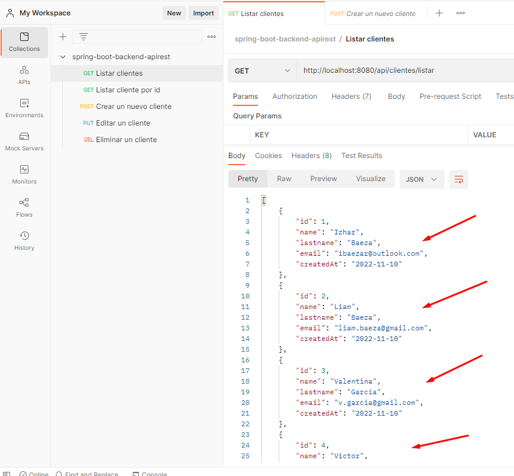
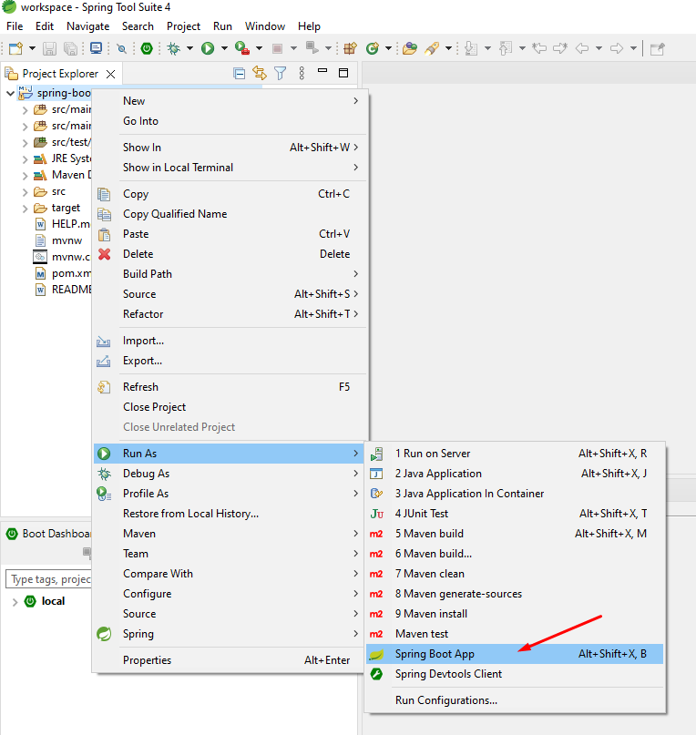
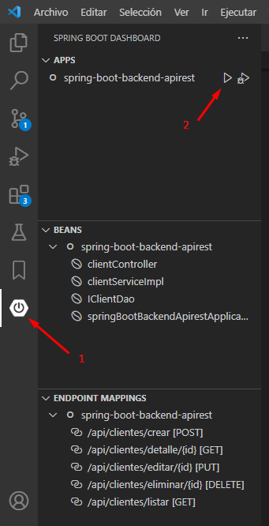
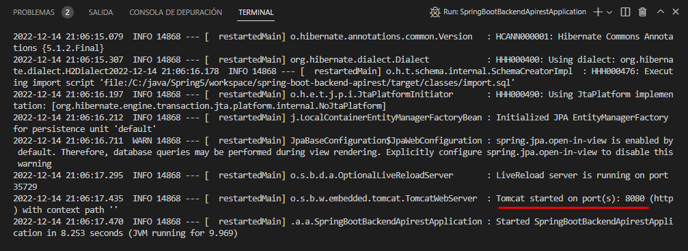
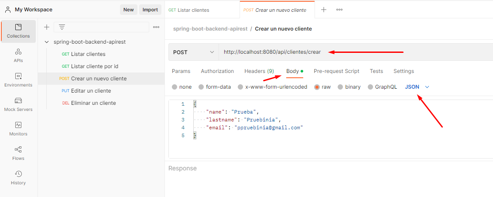

# Spring Boot Backend Apirest

Este proyecto fue desarrollado con Springboot versión 2.7.6.

Es un proyecto Backend Apirest, el cual proporciona datos a una aplicación Frontend desarrollada con Angular

## ¿Qué hace esta web?
***
Simplemente proporciona datos de clientes ficticios (de prueba) en formato JSON para que puedan ser consumidos por cualquier aplicación frontend web.

Proporciona las funciones necesarias para un CRUD, lo que, en palabras simples, sirve para obtener información desde una base de datos, poder crear nuevos registros, poder editarlos y también poder eliminarlos. Lo cual son las típicas funciones BASE de toda aplicación, ya sea Web, Escritorio o Mobile.

## Tecnologías principales usadas
***

* Springboot 2.7.6
* Data JPA
* H2 Database.

## ¿Como correr esta aplicación?
***

Opcionalmente podemos usar la aplicación sola (Sin un frontend), pero las consultas tendrán que ser realizadas con algún cliente Web, como por ejemplo [Postman](https://www.postman.com/) y los datos se verán de la siguiente forma:

En primer lugar tenemos la opción de ver el Backend(Esta app) y el frontend funcionando juntos desde el siguiente link: [Angular Frontend App]() 

Otra opción es descargar este código o clonarlo con Git para tenerlo de forma local en nuestro equipo.

## Requisitos para poder hacer despliegue de esta aplicación en tu computador
***

Tener instalado y desplegado el Frontend, un proyecto que fue desarrollado para consumir los datos de esta Apirest, remítase al link: [Angular Frontend App](https://github.com/ibaezar/angular-frontend-app) para obtener más información de esta parte del proyecto.

O también como se mencionó antes, tener instalado un cliente Web como [Postman](https://www.postman.com/).

Tener también instalado en nuestro equipo las herramientas de Java: JDK o OpenJDK y algún editor o Ide de su preferencia, tales como Eclipse, Visual Studio Code con la extensión de Spring tools o simplemente el IDE Spring Tools(Recomendado).

Enlace a las herramientas necesarias.

* [Java JDK](https://www.oracle.com/java/technologies/downloads/)
* [Java OpenJDK](https://openjdk.org/projects/jdk/19/)
* [Eclipse](https://www.eclipse.org/downloads/)
* [Visual Studio Code](https://code.visualstudio.com/)

En este enlace encontramos el IDE Spring tools y también las extensiones para Eclipse y Visual Studio Code entre otros.
* [Spring Tools](https://spring.io/tools)

## Despliegue de la aplicación
***

Una vez instalado un IDE o editor de código según la preferencia, abrimos el proyecto.

**Casos de ejemplo**

En el caso de usar Spring Tools, al costado izquierdo tendremos el proyecto, hacemos clic derecho en él y seleccionamos Run As -> Spring Boot App.

Posteriormente el proyecto empezará a ejecutarse y aparecerá una consola con lo siguiente.

En el caso de usar Visual Studio Code, al costado izquierdo tendremos el icono de spring boot, lo seleccionamos y en la ventana APPS nos aparecerá el nombre del proyecto. simplemente damos clic derecho y seleccionamos 'run' o presionamos el símbolo de play.

Una vez ejecutado el proyecto aparecerá en consola lo siguiente:

Y como podemos apreciar, nos indica que el proyecto levantó en el puerto 8080, lo cual nos servirá para hacer las consultas desde el proyecto frontend mencionado anteriormente o simplemente desde el cliente web Postman

Las consultas se hacen haciendo referencia al enlace localhost más el puerto (http://localhost:8080/), más los EndPoints respectivos.

Ej. http://localhost:8080/api/clientes/listar

## End Points
***
Listar todos los clientes
* Endpoint(GET): /api/clientes/listar

Ver detalle de un cliente
* Endpoint(GET): /api/clientes/detalle/{id}

Crear un nuevo cliente
* Endpoint(POST): /api/clientes/crear

Actualizar un cliente
* Endpoint(PUT): /api/clientes/editar

Eliminar un cliente
* Endpoint(DELETE): /api/clientes/eliminar/{id}

Para el caso de los Endpoints de crear y actualizar clientes, se debe enviar los  datos del cliente en el cuerpo de la consulta en formato JSON como en el siguiente ejemplo:

## Contacto
***

* [Web](https://ibaezar.herokuapp.com/)
* [Linkedin](https://www.linkedin.com/in/ibaezar/)
* [Correo](mailto:ibaezar@outlook.com)
* [Whatsapp](https://wa.me/56936330855)